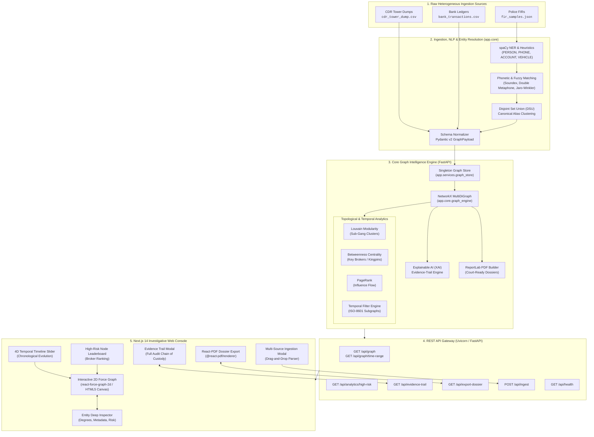

# CHITRAGUPTA — AI-Powered Criminal Network Analysis System
### Smart India Hackathon Prototype (Problem Statement: SIH26189)

[](https://fastapi.tiangolo.com)
[](https://nextjs.org)
[](https://www.typescriptlang.org/)
[](https://networkx.org/)
[](https://www.python.org/)
[](https://tailwindcss.com)
[](#)

---

## 1. Executive Summary

Law enforcement and intelligence agencies routinely struggle to uncover syndicated criminal networks due to multi-source data fragmentation. Vital evidentiary data resides across disparate silos:
- **First Information Report (FIR) narratives** (unstructured police incident text, witness statements, and accused listings).
- **Call Detail Record (CDR) tower dumps** (high-volume telecommunications logs, cell tower IDs, IMEI handshakes, and call durations).
- **Bank transaction ledgers** (financial transfer flows, mule account movements, and money-laundering trails).

**CHITRAGUPTA** is an enterprise-grade Graph Intelligence & Entity Resolution platform designed to ingest multi-source forensic datasets, dynamically resolve suspect identities across phonetic and alias variations, compute high-order topological network metrics (Betweenness Centrality, PageRank, Louvain community clustering), and present investigators with an interactive, temporal, and explainable 4D graph interface alongside court-ready PDF investigative dossiers.

---

## 2. System Architecture



---

## 3. Key Modules & Engineering Highlights

### 3.1 Entity Resolution & Phonetic Disambiguation (`backend/app/core/resolver.py`)
- **Alias Normalization**: Merges complex alias variations common in Indian law enforcement narratives (e.g., `"Rakesh alias Bunty"`, `"Ramesh Kumar"` vs. `"Rama"`).
- **Phonetic Matching Chain**: Leverages `jellyfish` (Double Metaphone, Soundex, Jaro-Winkler) with a fallback to `difflib` token similarity matrices.
- **DSU Clustering**: Employs Disjoint Set Union (DSU) graph clustering to guarantee transitive entity unification without duplicate circular node definitions.

### 3.2 High-Throughput Ingestion Engine (`backend/app/core/nlp.py`)
- **SpaCy & Regular Expressions**: Extracts entities across Indian phone numbers (+91 / 10-digit), vehicle license plates, bank account numbers (IFSC-aware), and FIR identification codes.
- **Unified Master Orchestrator**: `parse_all_sources(data_dir)` dynamically converts unaligned CSVs and JSON into a validated `GraphPayload` conforming to Pydantic v2 models.

### 3.3 Graph Analytics & Temporal Engine (`backend/app/core/graph_engine.py`)
- **In-Memory MultiDiGraph**: Retains parallel directed interactions (multiple calls or transactions between identical entities over time).
- **Betweenness Centrality**: Pinpoints intermediary "bridge" nodes who control communications between distinct syndicates (broker candidates).
- **PageRank Algorithm**: Evaluates systemic prestige and recursive flow of authority and illicit funds.
- **Louvain Community Partition**: Partitions complex criminal ecosystems into isolated operational sub-cells.
- **Temporal Subgraph Filtering**: Fast ISO-8601 interval queries that slice the graph dynamically without altering underlying memory structures.

### 3.4 Explainable AI (XAI) Evidence Trail (`backend/app/services/evidence_service.py`)
- Ensures every predicted link and risk score is traceable back to legally admissible records.
- Provides granular provenance: FIR case numbers, verbatim incident narrative snippets, CDR call record IDs, IMEI records, and banking transaction reference IDs.

### 3.5 Court-Ready Dossier Engine (`backend/app/services/dossier_service.py` & `frontend/components/export/DossierPdf.tsx`)
- Generates court-admissible, tamper-evident PDF dossiers.
- Backed by dual compilation:
  1. **Server-Side Engine**: ReportLab A4 document generator streaming binary PDF attachments via `/api/export-dossier`.
  2. **Client-Side Engine**: Next.js `@react-pdf/renderer` rendering instant cryptographic report previews directly in the browser.

---

## 4. Data Model & Contract Specifications

### Node Schema (`NodeType`)
| Type | Description | Primary Key Format | Example Attributes |
| :--- | :--- | :--- | :--- |
| `Suspect` | Accused individual / person of interest | `suspect_<canonical_name>` | `aliases`, `role`, `betweenness`, `pagerank`, `riskScore` |
| `Phone` | Mobile subscriber identity | `phone_<number>` | `service_provider`, `primary_user`, `imei_history` |
| `Account` | Financial banking entity | `account_<account_no>` | `bank_name`, `ifsc`, `mule_risk_flag` |
| `Location` | Cell tower location / Crime hotspot | `location_<tower_id>` | `latitude`, `longitude`, `radius_meters` |
| `CrimeCase`| FIR / Criminal incident record | `crime_fir_<year>_<id>` | `sections_invoked`, `police_station`, `filing_date` |

### Edge Schema (`EdgeType`)
| Type | Source &rarr; Target | Weight Metric | Admissible Evidence Metadata |
| :--- | :--- | :--- | :--- |
| `CALLED` | `Phone` &rarr; `Phone` | Call Frequency / Duration | `cdr_id`, `duration_seconds`, `cell_tower_id`, `imei` |
| `TRANSFERRED` | `Account` &rarr; `Account` | Monetary Value (INR ₹) | `transaction_id`, `amount`, `channel`, `timestamp` |
| `OPERATES` | `Suspect` &rarr; `Phone` / `Account` | Direct Ownership | `kyc_reference`, `sim_registration`, `source_doc` |
| `USES` | `Phone` &rarr; `Location` | Cell Tower Ping | `cdr_id`, `azimuth`, `signal_strength`, `timestamp` |
| `CO_ACCUSED_IN` | `Suspect` &rarr; `CrimeCase` | Legal Indictment | `fir_id`, `fir_excerpt`, `court_jurisdiction` |

---

## 5. Repository Structure

```
SIH-Prototype/
├── README.md                          # Comprehensive System Architecture & Documentation
├── data/                              # Forensic Datasets & Pre-computed Graphs
│   ├── bank_transactions.csv          # Financial transactions & mule account transfers
│   ├── cdr_tower_dump.csv             # Telecommunications CDR & cell tower dumps
│   ├── clean_graph.json               # Canonical resolved baseline graph
│   ├── fir_samples.json               # Unstructured First Information Reports (FIRs)
│   └── sample_graph.json              # Demonstration test graph
├── backend/                           # FastAPI High-Performance Analytics Server
│   ├── requirements.txt               # Production Python dependencies
│   └── app/
│       ├── main.py                    # Application factory, middleware & routing
│       ├── api/                       # API Endpoints
│       │   ├── analytics.py           # High-risk node ranking (/api/analytics/high-risk)
│       │   ├── dossier.py             # Server-side PDF export (/api/export-dossier)
│       │   ├── evidence.py            # Evidence-trail provenance (/api/evidence-trail)
│       │   ├── graph.py               # Cytoscape elements & time-range (/api/graph)
│       │   └── health.py              # Health check & probe (/api/health)
│       ├── core/                      # Algorithmic & Graph Intelligence Core
│       │   ├── graph_engine.py        # NetworkX engine, centralities, Louvain & filters
│       │   ├── nlp.py                 # Multi-source parser, spaCy NER & orchestrator
│       │   └── resolver.py            # DSU clustering & phonetic entity disambiguation
│       ├── models/                    # Pydantic v2 Data Contracts
│       │   └── graph_models.py        # Strict NodeModel, EdgeModel, GraphPayload
│       └── services/                  # Business Logic & Singletons
│           ├── dossier_service.py     # ReportLab PDF synthesis
│           ├── evidence_service.py    # Multi-hop relationship trail lookup
│           └── graph_store.py         # Thread-safe GraphEngine singleton & bootstrap
└── frontend/                          # Next.js 14 Investigative Web Console
    ├── package.json                   # Dependencies, build scripts & metadata
    ├── tailwind.config.js             # Styling tokens, glassmorphism & dark-mode theme
    ├── tsconfig.json                  # TypeScript compiler settings
    ├── app/                           # Next.js App Router
    │   ├── layout.tsx                 # Root layout & dark-theme wrapper
    │   └── page.tsx                   # Main unified command center dashboard
    ├── components/
    │   ├── GraphCanvas.tsx            # Static graph renderer fallback
    │   ├── canvas/
    │   │   └── ForceGraphCanvas.tsx   # 2D physics-based force-directed canvas
    │   ├── controls/
    │   │   └── TimelineSlider.tsx     # 4D time scrubber with play/pause controls
    │   ├── export/
    │   │   └── DossierPdf.tsx         # Client-side React-PDF report generator
    │   ├── inspectors/
    │   │   └── NodeInspector.tsx      # Slide-out entity dossier & associate inspector
    │   ├── intelligence/
    │   │   └── RiskLeaderboard.tsx    # Live Betweenness/PageRank suspect leaderboard
    │   └── modals/
    │       ├── EvidenceModal.tsx      # Provenance audit dialog (XAI evidence trail)
    │       └── IngestionModal.tsx     # Drag-and-drop forensic file ingestion dialog
    ├── lib/
    │   └── api.ts                     # Universal API client, fallbacks & payload mappers
    └── types/
        └── graph.ts                   # TypeScript interfaces matching backend models
```

---

## 6. REST API Reference

The backend exposes a self-documenting OpenAPI interface at `http://localhost:8000/docs`.

### Core Endpoints

#### 1. Graph State & Filtered Subgraph
```http
GET /api/graph?start_time={ISO_8601}&end_time={ISO_8601}
```
- **Description**: Returns all nodes and edges in Cytoscape.js interchange format. If timestamps are provided, returns the temporal slice.
- **Response**:
```json
{
  "elements": {
    "nodes": [
      {
        "data": {
          "id": "suspect_ramesh_kumar",
          "label": "Ramesh Kumar",
          "type": "Suspect",
          "betweenness": 0.625,
          "pagerank": 0.214,
          "community_id": 1,
          "metadata": { "aliases": ["Bunty"] }
        }
      }
    ],
    "edges": [
      {
        "data": {
          "id": "edge_a1b2c3d4",
          "source": "phone_9876543210",
          "target": "phone_9876512345",
          "type": "CALLED",
          "timestamp": "2024-04-12T14:30:00Z",
          "amount": null,
          "metadata": { "duration": 184, "cdr_id": "CDR_0042" }
        }
      }
    ]
  }
}
```

#### 2. Temporal Bounds
```http
GET /api/graph/time-range
```
- **Description**: Returns earliest and latest interaction timestamps across the network.
- **Response**:
```json
{
  "earliest": "2024-03-15T00:00:00Z",
  "latest": "2025-01-20T18:45:00Z"
}
```

#### 3. High-Risk Suspect Leaderboard
```http
GET /api/analytics/high-risk?limit=5
```
- **Description**: Computes and returns top nodes ranked by Betweenness Centrality (identifying syndicate brokers and coordinators).

#### 4. Explainable Evidence Trail
```http
GET /api/evidence-trail?source={node_id}&target={node_id}&bidirectional=true
```
- **Description**: Returns all direct evidentiary relationships between two nodes, including FIR excerpts, call metadata, and bank transaction IDs.

#### 5. Court-Ready Dossier Export
```http
GET /api/export-dossier
```
- **Description**: Generates and downloads an official A4 investigative summary PDF.

#### 6. Dynamic Ingestion
```http
POST /api/ingest
Content-Type: application/json
```
- **Payload**: Full `GraphPayload` `{ "nodes": [...], "edges": [...] }`.
- **Description**: Atomically resets and re-indexes the GraphEngine with newly processed data.

---

## 7. Setup & Installation Guide

### Prerequisites
- **Python**: Version `3.11` or higher
- **Node.js**: Version `18.17` or higher (`v20+` recommended)
- **Package Managers**: `npm` or `pnpm`, and `pip`

---

### Step 1: Clone the Repository
```bash
git clone https://github.com/Pranav-git27/SIH-Proto.git
cd SIH-Proto
```

---

### Step 2: Backend Setup & Execution

1. Navigate to the backend directory and activate your virtual environment:
   ```bash
   cd backend
   # Windows (PowerShell):
   python -m venv .venv
   .venv\Scripts\Activate.ps1

   # Linux/macOS:
   python3 -m venv .venv
   source .venv/bin/activate
   ```

2. Install dependencies:
   ```bash
   pip install -r requirements.txt
   ```

3. Launch the FastAPI server:
   ```bash
   uvicorn app.main:app --host 0.0.0.0 --port 8000 --reload
   ```
   *The backend API will be live at `http://localhost:8000` (API Docs at `http://localhost:8000/docs`).*

---

### Step 3: Frontend Setup & Execution

1. Open a new terminal and navigate to the frontend directory:
   ```bash
   cd frontend
   ```

2. Install packages:
   ```bash
   npm install
   ```

3. Configure environment variables (optional, defaults to `http://localhost:8000`):
   ```bash
   # .env.local
   NEXT_PUBLIC_BACKEND_URL=http://localhost:8000
   ```

4. Launch Next.js development server:
   ```bash
   npm run dev
   ```
   *Access the web console at `http://localhost:3000`.*

---

## 8. Verification & Quality Assurance

To verify the integrity and type contracts across both stacks:

```bash
# Verify Backend startup and graph bootstrapping
python -c "import app.main; print('Backend loaded successfully:', app.main.app.title)"

# Verify Frontend TypeScript strict compilation
cd frontend
npm run type-check
```

---

## 9. Security, Chain of Custody & Ethics

1. **Chain of Custody**: All evidence relations preserve the originating file reference, primary identifier (e.g., FIR number, CDR sequence, bank transaction ID), and timestamp to maintain evidentiary integrity.
2. **Air-Gap Capability**: The platform has zero mandatory external cloud dependencies; graph computation, NLP entity resolution, and dossier rendering execute entirely on-premise.
3. **Auditability**: Explainable AI (XAI) transparency ensures zero black-box scoring—every risk metric is deterministically calculated through graph topology and forensic cross-references.

---

<div align="center">
  <sub>Developed for the Smart India Hackathon (SIH26189) • Law Enforcement AI Graph Intelligence</sub>
</div>
